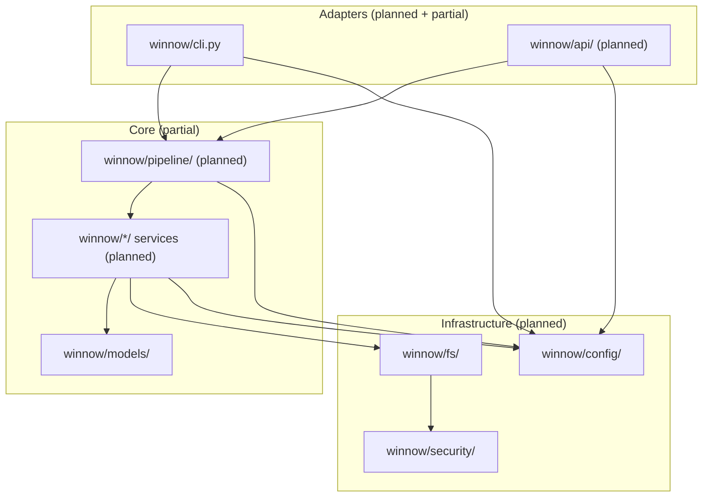
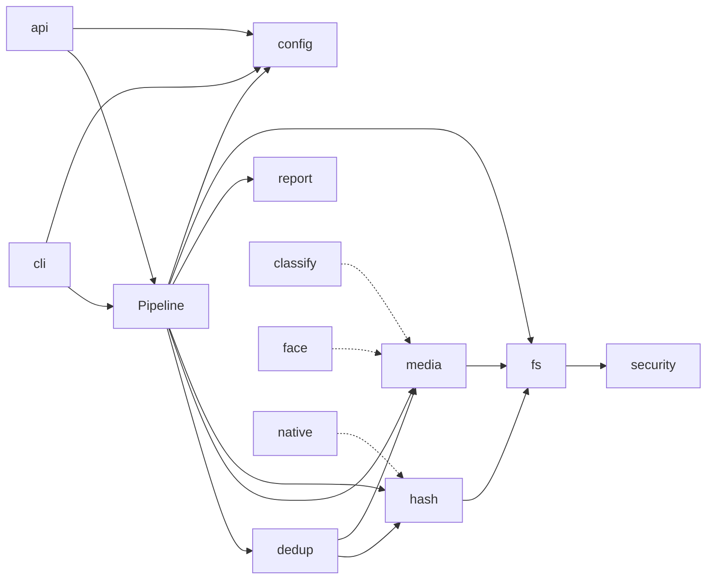

# Winnow Architecture

This document describes module boundaries, layering, and patterns for the `winnow-media`
package. Binding decisions live in
[ADR 0001: API-First Platform, CLI-First Phasing](adr/0001-api-first-platform.md).

## Goals

- Keep business logic in the `winnow/` core package, testable without subprocess or
  HTTP.
- Treat CLI and HTTP API as thin adapters over shared pipeline and service APIs.
- Publish OpenAPI as the stable integration contract for automation and future UI.
- Split code by domain from day one — no grab-bag `utils/` directory.

## Current package layout

The repository ships one Python package (`winnow/`) distributed on PyPI as
`winnow-media`. Only the skeleton below exists today; domain modules listed later are
planned, not implemented.

```text
winnow/
├── __init__.py          # package version
├── cli.py               # Click entry point (adapter)
├── exceptions.py        # WinnowError hierarchy
├── py.typed             # PEP 561 typed-package marker
└── models/              # Pydantic v2 domain models (implemented)
    ├── __init__.py      # public re-exports for winnow.models
    ├── config.py        # WinnowConfig stub
    ├── duplicates.py    # DuplicateGroup, DuplicatePair, QualityScore
    ├── enums.py         # HashAlgorithm, SortOrder, MediaCategory, FileAction
    ├── media.py         # MediaFile, MediaMetadata, MediaType
    └── pipeline.py      # PipelineStep, RunMetadata, PipelineResult
```

The CLI exposes `winnow`, `winnow --help`, and `winnow --version` only. No media
workflows, service layer, or HTTP API exist yet.

## Layering model

Winnow uses three layers. Dependency arrows point inward — adapters may call core; core
never imports adapters.

Media workflows enter core through pipeline entrypoints. Pipeline steps orchestrate
domain services, and adapters may call non-workflow service APIs only for narrow
surfaces such as health, config, or report reads. In the target-state diagram below, the
domain modules (`dedup`, `media`, `hash`, `report`) are the service packages.



Adapters may read `config/` directly for bootstrapping only (loading and validating
settings at startup); domain logic receives configuration through services and the
pipeline rather than reading it ad hoc.

| Layer                    | Responsibility                                      | Must not contain              |
| ------------------------ | --------------------------------------------------- | ----------------------------- |
| Adapters                 | Parsing, routing, presentation, HTTP mapping        | Domain rules, file mutations  |
| Core pipeline + services | Workflow entrypoints, orchestration, dedup, reports | Click options, FastAPI routes |
| Infrastructure           | Config load, path checks, atomic I/O, caches        | Business policy beyond safety |

See [ADR 0001](adr/0001-api-first-platform.md) for phasing: Phase 1 ships CLI + API;
Phase 2 UI talks HTTP only.

## Domain models (implemented)

All shared data shapes use **Pydantic v2** with `validate_assignment=True`. Enumerations
use **`StrEnum` with `auto()`** so JSON/OpenAPI values stay stable.

| Module                 | Types                                     | Role                              |
| ---------------------- | ----------------------------------------- | --------------------------------- |
| `models/enums.py`      | `HashAlgorithm`, `SortOrder`, …           | Cross-cutting enums               |
| `models/config.py`     | `WinnowConfig`                            | Config surface (loader not wired) |
| `models/media.py`      | `MediaType`, `MediaMetadata`, `MediaFile` | Scanned files + metadata          |
| `models/duplicates.py` | `QualityScore`, `DuplicatePair`, …        | Duplicate detection results       |
| `models/pipeline.py`   | `PipelineStep`, `RunMetadata`, …          | Run lifecycle and aggregates      |

`WinnowConfig` is a schema stub: defaults and validation only. Filesystem loading via
`.winnow-config.yaml` lands in the config epic ([#3][epic-3]).

Models are exported from `winnow.models` for adapters and tests. Prefer importing public
names from there rather than deep submodule paths.

## Exception hierarchy (implemented)

All recoverable failures inherit from `WinnowError` in `winnow/exceptions.py`. Each
error carries structured `ErrorContext` (`operation`, `file_path`, `details`) for
logging and API responses.

```text
WinnowError
├── ConfigError
├── MediaError
├── HashError
├── CacheError
├── PipelineError
├── SecurityError
└── DuplicateError
```

Standards (enforced in code review and ADR 0001):

- Catch specific exceptions; never bare `except:`.
- Chain underlying errors with `raise ... from ...` when wrapping.
- Use context managers for files and other resources requiring cleanup.
- Strict mypy with zero `# type: ignore`.

Map domain errors to CLI exit codes or HTTP problem details in adapters only — do not
leak transport concerns into core modules.

## Planned domain modules

The table maps **planned** package areas to GitHub epics. Paths follow domain names from
ADR 0001; nothing below exists in the tree yet unless noted.

| Planned path            | Epic           | Scope                                         |
| ----------------------- | -------------- | --------------------------------------------- |
| `winnow/config/`        | [#3][epic-3]   | Dynaconf loader, YAML schema, validation      |
| `winnow/security/`      | [#3][epic-3]   | Path validation, symlink policy               |
| `winnow/fs/`            | [#3][epic-3]   | Atomic moves/copies, backup helpers           |
| `winnow/media/`         | [#4][epic-4]   | Format registry, image/video/audio processors |
| `winnow/hash/`          | [#6][epic-6]   | Perceptual hashing, content + metadata cache  |
| `winnow/dedup/`         | [#5][epic-5]   | Hamming grouping, quality comparator          |
| `winnow/pipeline/`      | [#7][epic-7]   | Steps, saga, `PipelineContext`, plugins       |
| `winnow/report/`        | [#8][epic-8]   | SQLite v2 schema, exports, local preview      |
| `winnow/cli/` (package) | [#9][epic-9]   | Subcommands; `cli.py` remains entry point     |
| `winnow/api/`           | [#11][epic-11] | FastAPI app, jobs, OpenAPI export             |

Optional later areas: `winnow/classify/` ([#10][epic-10]), face recognition
([#12][epic-12]), native batch hasher ([#13][epic-13]). Phase 2 web UI ([#14][epic-14])
consumes HTTP only.

### Boundary rules

- `config/` owns loading and merging settings into `WinnowConfig`; it does not scan
  media.
- `media/` extracts metadata and normalizes formats; it does not decide duplicate
  keep/delete policy.
- `hash/` computes digests and manages caches; it does not group duplicates.
- `dedup/` compares hashes and scores quality; it does not move files.
- `pipeline/` orchestrates steps and reversible file ops; individual steps delegate to
  domain services.
- `api/` and CLI handlers call the same service functions with typed models — no
  duplicated logic.

## Organize pipeline (planned)

The primary workflow runs five steps. The `PipelineStep` enum in `models/pipeline.py`
defines the contract today:

| Step | Enum value      | Planned responsibility                                               |
| ---- | --------------- | -------------------------------------------------------------------- |
| 1    | `DISCOVERY`     | Walk source roots, apply filters, emit `MediaFile` list              |
| 2    | `METADATA`      | Enrich files via `media/` processors                                 |
| 3    | `SCAN`          | Hash content (`hash/`), dated layout (epic [#7][epic-7] "Execution") |
| 4    | `DEDUPLICATION` | Group duplicates, rank quality, propose actions                      |
| 5    | `REPORTING`     | Persist run metadata, export report artifacts                        |

Naming note: the `SCAN` enum value corresponds to the step epic [#7][epic-7] calls
"Execution"; content hashing itself is scoped by epic [#6][epic-6], and the final split
between steps 3 and 4 is not yet settled.

`PipelineResult` aggregates `RunMetadata`, completed steps, duplicate groups, counts,
and non-fatal error strings. Step implementations will live under
`winnow/pipeline/steps/` (not present yet).

### Command and saga patterns (planned)

Reversible file changes use a **command** pattern (Move, Copy, Delete, CreateDir) plus a
**saga** backed by a SQLite transaction log ([#7][epic-7]). Commands record enough state
to undo; the saga coordinates commit and rollback across steps. File mutations go
through `winnow/fs/` atomic helpers, not ad hoc `shutil` calls in adapters.

### PipelineContext / dependency injection (planned)

`PipelineContext` (planned in `winnow/pipeline/`) is the composition root for a run:
config, caches, hashers, media services, and report writers are constructed once and
passed into steps. This avoids circular imports between CLI subcommands and keeps tests
able to inject fakes without Click or FastAPI.

### Plugin registry and event bus (planned)

Epic [#7][epic-7] adds a plugin protocol and event bus so optional extras (e.g.
`winnow[face]`) register hooks without editing core steps. Plugins initialize in
topological order; events announce step boundaries for metrics and extensions. No plugin
API exists in the repository yet.

## API-first adapters (planned)

The FastAPI layer ([#11][epic-11]) mirrors CLI capabilities:

- Health and config endpoints share `WinnowConfig` models.
- Long-running organize jobs enqueue work executed by the same pipeline entrypoints the
  CLI invokes synchronously.
- Report query routes read the SQLite v2 schema from the report epic.
- OpenAPI schema is exported in CI as a contract test artifact.

Adapters translate transport input/output only. Request bodies and responses reuse
Pydantic models from `winnow/models/` (and generated API wrappers where needed).

## Module dependency diagram (target state)

Solid lines reflect intended dependencies once Phase 1 epics land. Dashed lines are
optional extras.



## Adding new code

1. Extend or add Pydantic models under `winnow/models/` when the data shape is shared.
2. Implement domain logic in the appropriate planned module (or a new domain module —
   never `utils/`).
3. Wire orchestration in `winnow/pipeline/` when the change affects run flow.
4. Expose via CLI and/or API only after the service API is stable and tested.
5. Record architectural shifts in a new ADR under `docs/adr/`.

## Related documentation

- [ADR index](adr/README.md)
- [ADR 0001: API-First Platform, CLI-First Phasing](adr/0001-api-first-platform.md)
- [Contributing](../CONTRIBUTING.md)
- [Open issues](https://github.com/lgtm-hq/winnow/issues) and epic labels (`core`,
  `pipeline`, `api`, …)

[epic-3]: https://github.com/lgtm-hq/winnow/issues/3
[epic-4]: https://github.com/lgtm-hq/winnow/issues/4
[epic-5]: https://github.com/lgtm-hq/winnow/issues/5
[epic-6]: https://github.com/lgtm-hq/winnow/issues/6
[epic-7]: https://github.com/lgtm-hq/winnow/issues/7
[epic-8]: https://github.com/lgtm-hq/winnow/issues/8
[epic-9]: https://github.com/lgtm-hq/winnow/issues/9
[epic-10]: https://github.com/lgtm-hq/winnow/issues/10
[epic-11]: https://github.com/lgtm-hq/winnow/issues/11
[epic-12]: https://github.com/lgtm-hq/winnow/issues/12
[epic-13]: https://github.com/lgtm-hq/winnow/issues/13
[epic-14]: https://github.com/lgtm-hq/winnow/issues/14
